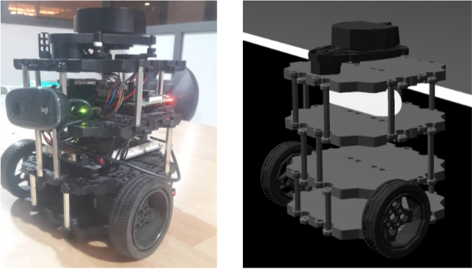

# Phase 2: Physical Robot

<!-- ***

!!! note 
    Phase 2 instructions are **currently locked** and would be available by July 1st 2022! -->

Welcome to Phase 2 of the PARC Engineers League Competition 2022. You are here because you qualified from the phase 1 of the competition. Congratulations!

In this Phase, teams will improve and adapt their Phase 1 solutions for deployment on a physical robot to successfully complete the delivery task. Specifically, teams are required to develop and test their software iteratively in simulation and on the physical robot on July the first 2022.

The simulation platform remains [Gazebo Simulator](http://gazebosim.org/). Teams will improve their Phase 1 solutions in simulation and then test in real time on the physical robot through remote access.

##### Delivery Robot

!!! note 
    The delivery robot used in Phase 2 is changed from what was used in Phase 1. However, we do not expect this to cause any issues with your software development.

The delivery robot to be used in Phase 2 is the **Turtlebot3 Burger**. It is a ground mobile robotfitted with a 2D LiDAR (light detection and ranging or laser scanner) and an RGB camera. The figure below shows the delivey robot: physical robot (left) and simulated robot (right). 

***

##### Physical Field

The physical field was built to emulate the realistic street structure with roads, sidewalks, a crosswalk, traffic signs and buildings explored in Phase 1. The entire field is 3.6 x 7.8 meters in dimension. A top view of the field is shown below:

***

##### Simulation Environment
The simulation environment is a modelled replica of the physical field with consistent features. Teams will use develop and test their software in this simulation environment before deploying on the physical robot and field. A top view of the simulation filed is shown below:

